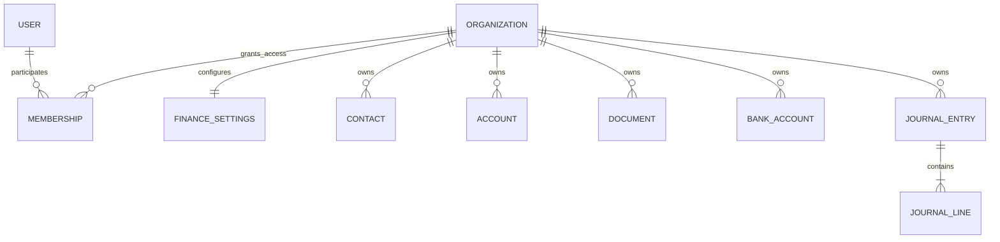
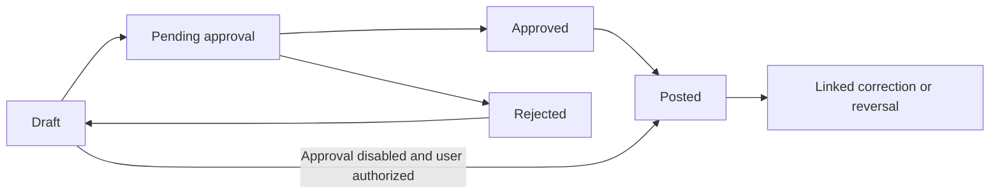

# Generalized Finance System — Production Product and Architecture Plan

**Date:** 17 September 2026  
**Status:** Proposed plan for review; no finance implementation performed  
**Goal:** Create a complete production finance product for small and midsize businesses across industries and countries, with independent organization books and multi-organization users.  
**Architecture:** One Django application with focused finance modules and a shared transactional posting engine. Every organization has independent books; users participate through existing memberships. Country-specific behavior is separated from common accounting.  
**Existing stack:** Django/DRF, PostgreSQL, Clerk identity, Redis, Celery, pytest. Reuse these choices.  
**Evidence:** [CIA review and competitor analysis](C:/Users/builtpulse/Desktop/uap/docs/research/2026-09-17-finance-competitor-analysis.md).

This is a production-product roadmap, not an MVP plan. Phases define construction order, not permission to launch an incomplete product. Production launch requires the functional baseline below and the operational release gate. Each work package receives its own Speckit specification, implementation plan, and executable task list before production code is written. Dates and staffing are not assumed; sequence is defined by dependencies and release criteria. The accompanying [LLM and agent build guide](C:/Users/builtpulse/Desktop/uap/docs/engineering/finance-agent-build-guide.md) is the execution contract for future implementation work.

## 1. Confirmed requirements and planning decisions

### Confirmed by the user

- Serve small and midsize businesses across industries.
- Review the CIA finance module for inspiration and research Zoho Books and competitors online.
- Do not introduce Entity or Business Center modules.
- Do not limit the product to Dubai or the UAE.
- Each organization has its own finance data.
- One user can belong to multiple organizations.
- Deliver a production-level product, not an MVP, and provide explicit guidance for LLMs/agents building it.
- Avoid redundant implementations and dead features. Production quality does not justify speculative product scope.

### Proposed defaults

- One organization represents one independent set of books, with one base currency and fiscal calendar. A user switching organizations changes the entire accounting context.
- Start with accrual accounting. Recording a cash sale/expense remains supported; statutory cash-basis reporting is a separate capability, not a report filter that can be added casually.
- Use generic, configurable bookkeeping first. Launch with country-specific filing or e-invoicing claims only after that country's adapter is implemented and verified.
- Provide responsive web workflows; separate native mobile applications are outside the initial scope.
- Include ordinary goods/services and optional stock tracking with verified valuation in the production baseline; stock behavior is implemented after the ledger, not omitted from launch scope.
- Keep source history; do not migrate CIA production data unless a separate migration is requested.

## 2. Organization ownership and access

UAP already defines `Organization`, `Membership`, and `Location` in [tenancy/models.py](C:/Users/builtpulse/Desktop/uap/backend/apps/tenancy/models.py). Reuse Organization and Membership. Do not create a second business owner model or rename CIA's Entity model into the new domain.

### Organization rules

| Concern                    | Decision                                                                                                                          |
| -------------------------- | --------------------------------------------------------------------------------------------------------------------------------- |
| Tenant identity            | Required `organization_id` on tenant-owned finance records; server assigns it from validated membership context                   |
| Books                      | Separate chart, base currency, fiscal year, taxes, numbering, contacts, items, banks, documents, reports, and audit trail         |
| Shared reference data      | Read-only currency/country definitions may be shared; user-owned tax configurations and accounts never are                        |
| Multiple memberships       | A user may be owner in A, accountant in B, and viewer in C; permissions do not transfer between organizations                     |
| Switching                  | Persistent organization name in navigation; warn before discarding unsaved edits; reset organization-dependent caches and filters |
| Relationships              | Related contacts, accounts, documents, attachments, and allocations must belong to the same organization                          |
| Numbering                  | Unique within organization, document type, and configured series; allocate under a database lock; never reuse issued numbers      |
| Imports and exports        | Run against one selected organization; downloaded files state organization and report period                                      |
| Support access             | Explicit, time-limited and audited if introduced; no ordinary user receives cross-organization finance access                     |
| Cross-organization reports | Not in this plan; switching organizations is not consolidation or intercompany accounting                                         |

Example: a user can manage an organization with USD books and another with EUR books. Each can independently issue `INV-0001`. A payment from the second organization's bank must not settle the first organization's invoice.

Existing Location must not silently become a replacement Business Center. No finance document requires a location. A location-restricted membership must not automatically receive organization-wide finance access: require an explicit organization-level finance grant. Existing location behavior outside finance remains unchanged. Optional reporting tags can be added later; tags do not define ownership or permissions.

### Roles and permissions

Provide Owner, Finance Admin, Accountant, Sales Clerk, Purchasing Clerk, Approver, and Viewer presets plus configurable organization-level roles. Enforce action permissions such as `finance.invoice.create`, `finance.document.post`, `finance.payment.record`, `finance.document.approve`, `finance.report.view`, and `finance.period.reopen` server-side. A generic application `member` role grants no finance access by itself. Require additional authentication for privileged access changes and sensitive operations using the existing identity provider capabilities.

Owner configures access and organization setup. Accountant posts journals and performs closing. Sales/Purchasing clerks prepare their documents. Approver authorizes configured transactions. Viewer reads permitted modules and reports. Permissions for exporting and payment recording are explicit. Where approval is required, the preparer cannot approve their own submission; owner-only businesses may disable that policy explicitly. Role presets reuse one permission system; they are not separate implementations of each workflow.

### Existing authentication integration that needs verification

The repository already has Clerk authentication, context resolution, and RLS helpers. These are a foundation, not proof that finance isolation is complete. The RLS helper uses transaction-local settings; middleware and DRF authentication timing must be checked before reuse. Verify trusted user/organization context is established **after authentication and inside the same transaction** as protected queries, including background jobs. Finance RLS policies need both read and write protection, a non-bypass application role, and same-organization relationship enforcement. Use real PostgreSQL tests; SQLite cannot prove these guarantees. [RLS helper](C:/Users/builtpulse/Desktop/uap/backend/apps/authentication/services/rls.py), [context middleware](C:/Users/builtpulse/Desktop/uap/backend/apps/authentication/middleware/context.py)

## 3. Product navigation and daily workflows

Proposed primary navigation: **Overview · Sales · Purchases · Banking · Contacts · Items · Accountant · Reports · Settings**. Approval tasks appear in Overview and within the relevant module. Stock functions live under Items; assets and closing live under Accountant. Country Tax Filing appears only for a complete supported country capability. Do not add empty navigation entries for possible future modules.

The overview should answer: what is owed to us, what do we owe, what cash is recorded, what is overdue, and what needs attention? Show bank statement balance separately from book balance and state when each was updated. Avoid implying unreconciled balances are verified cash.

### Core workflows

| Job               | Complete path                                                                        | Accounting consequence                                                                     |
| ----------------- | ------------------------------------------------------------------------------------ | ------------------------------------------------------------------------------------------ |
| Sell              | Customer → quote → invoice draft → optional approval → post → deliver → collect      | Invoice creates receivable, revenue, and applicable tax; collection settles the receivable |
| Buy               | Vendor → bill draft → optional approval → post → pay                                 | Bill creates payable and expense/asset/tax lines; payment settles the payable              |
| Record an expense | Payee/category → receipt → approval if enabled → post                                | Paid expense records expense/asset/tax against cash or bank                                |
| Correct a sale    | Original invoice → credit note → apply or refund                                     | Preserve the original document and show linked correction and settlement                   |
| Reconcile banking | Import → review duplicates → suggest matches → match or categorize → complete period | Matching creates no second payment journal; categorization creates a deliberate posting    |
| Close a period    | Resolve exceptions → reconcile → review reports → lock                               | Prevent backdated changes until an authorized, reasoned reopening                          |

Do not use `Sent` as the accounting posting trigger. Email delivery is a separate event and can fail after a valid posting. Retrying delivery must never create another journal. Quotes and purchase orders do not post to the general ledger.

### Document lifecycle

Keep settlement status separate: unpaid, partly paid, paid. Overdue is calculated from due date and remaining balance. Pending documents can show a posting preview but contribute nothing to financial statements. Changes to an approved draft invalidate that approval. Posted accounting fields cannot be edited; corrections receive their own dates and links.

## 4. Required production scope

All rows below are required before general availability. A phased implementation or private acceptance environment must not be described as the completed product. Country/provider-specific availability is documented separately and cannot be replaced with fake integrations.

| Requirement | Capability             | Production baseline                                                                                                                                                                             |
| ----------- | ---------------------- | ----------------------------------------------------------------------------------------------------------------------------------------------------------------------------------------------- |
| FIN-01      | Organizations/access   | Create/setup organizations, invitations, memberships, switching, custom roles, permission audit, tenant isolation                                                                               |
| FIN-02      | Ledger/close           | Chart, opening balances, journals, scheduled adjusting entries, reversals, trial balance, period/year close, immutable audit                                                                    |
| FIN-03      | Sales/receivables      | Quotes, sales orders, invoices, recurring billing, deposits/advances, receipts, credits/refunds, statements, reminders, customer portal                                                         |
| FIN-04      | Purchasing/payables    | Purchase orders, receipts, bills, expenses, recurring purchases, vendor credits/refunds, advances, payment runs, supplier statements                                                            |
| FIN-05      | Banking/payments       | Cash/bank/card accounts, statement import, supported direct feeds, rules, split/group matching, transfers, fees, reconciliation, selected gateway integration                                   |
| FIN-06      | Currency/tax           | Per-organization base currency, currency precision, rates/manual overrides, realized/unrealized FX, dated tax rules/groups, withholding/reverse-charge/recoverability semantics where supported |
| FIN-07      | Inventory              | Goods/services, optional tracked stock, warehouses, stock counts/adjustments/transfers, returns, moving-average valuation, COGS tie-out                                                         |
| FIN-08      | Reporting organization | Optional flat reporting tags on relevant transactions and reusable filters through the existing report queries; no separate project management system                                           |
| FIN-09      | Fixed assets           | Asset register, capitalization, depreciation schedules, impairment/adjustment workflow, disposal, ledger reconciliation                                                                         |
| FIN-10      | Reports                | GL, trial balance, P&L, balance sheet, formal cash-flow statement, AR/AP aging, tax reports, inventory valuation, asset reports, comparative periods, drill-through, PDF/CSV/XLSX               |
| FIN-11      | Controls/automation    | Configurable approval levels and amount thresholds, separation of duties, recurrence, notifications, attachments, reliable jobs; one shared approval mechanism                                  |
| FIN-12      | Migration/API          | Import previews/mappings/errors, duplicate protection, opening-balance reconciliation, complete authorized export, documented versioned API, authenticated integration webhooks                 |
| FIN-13      | Localization           | Country-neutral core, versioned country packs, verified required invoice/tax/e-invoice behaviors for explicitly selected launch markets                                                         |
| FIN-14      | User experience        | Complete responsive workflows, accessible controls, search/filter/bulk actions, clear states, safe organization switching, usable document templates                                            |
| FIN-15      | Operations/security    | CI/CD, staging, monitoring/alerts, threat model, restore-tested backups, migration/rollback runbooks, performance/capacity evidence, incident response and support procedures                   |

Payroll, manufacturing/MRP, lending, crypto custody, consolidation/intercompany accounting, arbitrary no-code application building, and native mobile apps are outside this product definition. Separate project management, timesheets, budgeting/forecasting suites, vendor portals, AI assistants, and universal custom-field engines are not scheduled merely for competitor parity. Add one only for a concrete accepted user workflow. These are explicit domain boundaries, not shortcuts around production quality. No missing baseline capability can be moved out of scope by an implementing agent without a recorded user decision.

Accrual financial statements are the default. Cash-basis or fund-accounting requirements must be implemented if a selected launch market/customer segment requires them; they cannot be represented as supported by relabeling accrual reports.

## 5. Accounting core and data design

Use a modular monolith: one deployment and database, with finance services grouped by responsibility. Avoid microservices, a custom workflow language, and a universal document schema before they solve a demonstrated need. Keep distinct business document models while sharing calculation and posting services.

### Main records

| Group                          | Records and purpose                                                                                                                                                                     |
| ------------------------------ | --------------------------------------------------------------------------------------------------------------------------------------------------------------------------------------- |
| Configuration                  | FinanceSettings, Currency reference, ExchangeRate, DocumentSequence, TaxCode, TaxRateVersion, FiscalPeriodLock                                                                          |
| Master data                    | Account, Contact with customer/vendor roles, Item, PaymentTerm                                                                                                                          |
| Sales                          | Quote/lines, Invoice/lines, CreditNote/lines, CustomerPayment, CustomerPaymentAllocation, CustomerRefund                                                                                |
| Purchases                      | Bill/lines, Expense/lines, VendorCredit/lines, VendorPayment, VendorPaymentAllocation, VendorRefund                                                                                     |
| Ledger                         | JournalEntry, JournalLine, explicit source/reversal links; postings generated from document snapshots                                                                                   |
| Banking                        | BankAccount, StatementImport, StatementLine, BankMatchAllocation, ReconciliationSession                                                                                                 |
| Controls                       | ApprovalDecision, AuditEvent, IdempotencyRecord, Attachment, ImportBatch, DeliveryJob                                                                                                   |
| Additional production packages | RecurringTemplate/Occurrence, StockMovement/ValuationEntry, PurchaseOrder/Receipt, SalesOrder, Warehouse, Asset/DepreciationSchedule, reporting tags, country return/submission records |

Use existing ID conventions. Monetary API fields are decimal strings. Store amounts with sufficient decimal capacity and quantize to each currency's precision; do not use binary floating point or a universal two-decimal assumption. Store higher precision for unit prices, quantities, and rates, with explicit upper bounds.

Every posted document snapshots names/addresses required on the issued document, line descriptions/prices, tax rules and results, applied exchange rate/date/source, and base-currency equivalents. Changes to a contact, tax rate, or item must not rewrite history.

### Posting contract

1. Authenticate; resolve the selected organization and action permission.
2. Open a transaction; establish trusted RLS context; lock the document, relevant allocation targets, and numbering/period-control records in a consistent order.
3. Recheck expected document version, approval, period status, account validity, organization relationships, and currency rules.
4. Recalculate totals server-side. Do not accept client-supplied totals as authoritative.
5. Generate journal lines and reject unexplained imbalances before publication.
6. Save the document's posted state, journal, audit event, idempotency result, and any delivery job atomically.
7. After commit, enqueue delivery and other side effects. A recoverable job row allows retry if queue dispatch fails.

This is one shared service path for API requests, imports, scheduled jobs, and future integrations. Accounting posting must not depend on model-save signals. Database constraints and restricted write paths must guard posted history even when a caller bypasses an API serializer.

### Non-negotiable invariants

- Published journal debits equal credits in base currency. Each line has a valid nonnegative debit or credit, not both; all accounts belong to the organization.
- No deletion or mutation of posted financial lines. A reversal references its original, carries a reason and actor, and cannot be duplicated by retry. Posted documents with settlements require correction workflows that account for those settlements.
- Idempotency is scoped to organization, operation, and request key. A replay with identical content returns the existing result; changed content with the same key is rejected. Concurrent requests cannot create duplicate postings.
- Payment and credit allocations cannot exceed either available funds/credit or target outstanding balance. Lock targets for concurrent allocations. Excess customer receipts are liabilities; vendor advances are assets.
- Period close and posting share a lock strategy so a close cannot race a backdated posting. Reopening is audited; reversal into a closed period is rejected unless that period is explicitly reopened.
- Reports use published entries and dated settlement events. Historical aging must not use today's outstanding balance for a past date. Drafts never leak into financial totals.
- Bank matching cannot post cash twice. One posted payment can be matched only up to its bank amount; statement allocations cannot exceed the statement line. Transfers require two GL-linked accounts and coherent treatment of both statement sides.
- Currency conversion uses a documented direction: base amount = transaction amount × stored rate. Missing rates stop posting. Settlement differences go to realized FX; approved closing revaluations go to unrealized FX with traceable subsequent treatment.
- Rounding adjustments are limited to an explicitly calculated rounding residual. Unexpected differences fail with a useful error and no partial posting.
- AR/AP control totals must tie to their subledgers. Direct manual entries to control accounts are restricted to validated opening/adjustment workflows with counterparties.

### Concrete acceptance examples

These figures are test scenarios, not country tax guidance.

| Scenario                                                   | Expected result                                                              |
| ---------------------------------------------------------- | ---------------------------------------------------------------------------- |
| Invoice net 100 plus illustrative tax 10                   | Dr AR 110; Cr revenue 100; Cr tax payable 10                                 |
| Receive 60 against that invoice                            | Dr bank 60; Cr AR 60; outstanding 50                                         |
| Receive 80 against remaining 50                            | Dr bank 80; Cr AR 50; Cr customer advance 30                                 |
| Pay 500 for a bill of 300                                  | Dr AP 300; Dr vendor advance 200; Cr bank 500                                |
| Match imported bank receipt to existing payment            | No new accounting entry; the statement allocation becomes matched            |
| EUR 100 receivable in USD books at 1.10, paid at 1.15      | Initial AR USD 110; settlement Dr bank 115, Cr AR 110, Cr realized FX gain 5 |
| Two concurrent allocations of 80 against an invoice of 100 | At most 100 allocated; the conflicting request fails atomically              |
| Read A's invoice while selected into B                     | No invoice data returned; export/attachments obey the same rule              |

## 6. International support without regional assumptions

Organization setup asks for country, base currency, fiscal year, timezone, language/format preferences, and whether tax registration applies. It does not default every organization to AED, Dubai, an emirate, or a VAT rate. Lock base-currency changes once postings exist; a later conversion would require a separately designed migration.

Use flexible international addresses: country, administrative area, locality, postal code, and address lines. Tax registrations carry a type, jurisdiction, value, and applicable dates. There is no mandatory universal TRN or emirate selector.

Separate three capabilities:

| Layer                  | Responsibility                                                                                                                      | Release rule                                                                  |
| ---------------------- | ----------------------------------------------------------------------------------------------------------------------------------- | ----------------------------------------------------------------------------- |
| Common bookkeeping     | Currency math, dated tax definitions, inclusive/exclusive amounts, discounts, tax snapshots, generic tax summary                    | Available in the common core after accounting verification                    |
| Country configuration  | Required invoice fields, tax categories, rounding policy, recoverability, withholding/reverse-charge rules, account/report mappings | Enable only supported, versioned behavior with fixtures and accountant review |
| Regulatory integration | Filing forms, authority credentials, e-invoice payloads, submission IDs, rejections, corrections                                    | Market-specific integration and verification before advertised support        |

The tax work package must cover simple and compound groups, no-tax/zero/exempt classifications, inclusive/exclusive pricing, discounts, effective-date snapshots, recoverable/nonrecoverable input tax, withholding, and reverse-charge postings. Tax recognition on invoice versus payment is a documented jurisdiction capability. A configurable label does not implement these semantics: each enabled behavior needs accounting fixtures and report mappings. Unsupported jurisdiction combinations must be unavailable rather than silently producing an approximate return.

Odoo's documentation supports this separation through country localization modules and tax mapping/distribution behavior. It is an architecture reference, not evidence that UAP is compliant. [Localizations](https://www.odoo.com/documentation/saas-19.1/applications/finance/fiscal_localizations.html), [tax mechanics](https://www.odoo.com/documentation/19.0/applications/finance/accounting/taxes.html)

Select compliance markets before specifying country adapters; this is a production release dependency. The absence of that choice does not block the country-neutral core. Test different currencies and formats early, including zero-, two-, and three-decimal currency cases, multiple timezones, and a non-January fiscal year. No market is assumed to be Dubai/UAE.

## 7. Delivery plan and acceptance gates

For every phase: write a bounded specification, define interfaces and failure cases, implement with meaningful accounting/security tests, and demonstrate the complete workflow before moving on. The items below are proposed work, not completed tasks. Phases 1–7 plus the operational workstream and release gates form one production delivery program; phase 4 is an internal integration milestone only.

### Phase 1 — Organization finance foundation and ledger

**Depends on:** Existing identity and tenancy; verified PostgreSQL access.

- [ ] Establish organization-scoped permissions and transaction-bound RLS for requests and jobs. Prove the same user can access A and B with different permissions.
- [ ] Add finance setup, base currency, chart of accounts, sequence generation, audit events, and dated period locks.
- [ ] Implement balanced manual journals, explicit posting, idempotency, immutable history, linked reversals, and opening balances.
- [ ] Expose trial balance and GL so posting results can be inspected immediately.
- [ ] Build setup, chart, journal, and organization-switching screens with the same server-side permission rules.

**Gate:** Duplicate concurrent posting yields one journal; an imbalanced journal produces no writes; cross-organization references fail; closed-period posting fails; a reversal preserves its original. PostgreSQL isolation tests pass using the intended application database role.

### Phase 2 — Sales and collection

**Depends on:** Phase 1.

- [ ] Add contacts, goods/service items, payment terms, generic tax configuration and document snapshots.
- [ ] Implement quotes, invoices, optional single-step approval, posting preview, printable documents, and separate delivery tracking.
- [ ] Add customer payments, dated allocations, credit notes, advances, and refunds with linked history.
- [ ] Support foreign-currency invoices/payments using manual stored rates and realized FX.
- [ ] Build sales lists/detail/editor, customer history, and AR aging with drill-through.

**Gate:** Demonstrate invoice → partial payment → credit → refund; retrying delivery cannot repost. Two concurrent allocations cannot over-settle an invoice. AR aging and GL agree at both current and historical dates.

### Phase 3 — Purchases and expenses

**Depends on:** Phase 2's contacts, tax calculations, and settlement conventions.

- [ ] Implement bills, paid expenses, vendor credits, vendor payments, advances, and refunds.
- [ ] Add attachment authorization, receipt preview, size/type limits, and organization-scoped downloads.
- [ ] Apply explicit purchasing/approval permissions and foreign-currency settlement handling.
- [ ] Build payable work queues and vendor statements; show overdue bills and AP aging.

**Gate:** Demonstrate bill → partial payment → vendor credit and overpayment/advance; AP subledger agrees with its control account. Sales-only users cannot perform purchasing writes.

### Phase 4 — Banking, reporting, and integrated accounting verification

**Depends on:** Phases 1–3.

- [ ] Add GL-linked bank/cash/card accounts and CSV statement import with preview, mapping, and duplicate review.
- [ ] Implement one-to-one, split, and grouped matching, categorization, bank fees, and same-/foreign-currency transfer workflows. Complete the specified combinations before the production gate.
- [ ] Record reconciliation sessions with opening/closing balances, period, matched amounts, completion evidence, and audited reopening.
- [ ] Finish P&L, balance sheet, AR/AP aging, tax summary, bank reconciliation, and cash movement reporting, with CSV export and print views.
- [ ] Add closing revaluation for monetary foreign-currency balances with a documented reversal/settlement policy.
- [ ] Provide migration previews and a reconciled opening-balance cutover; run restore and accountant review exercises.
- [ ] Complete end-to-end UI workflows, loading/error states, organization indicators, and permission checks.

**Gate:** A pilot business completes a sample month from opening balances to close. Trial balance balances; AR/AP tie; bank reconciliation has zero unexplained difference; comparative reports reproduce after reopening; foreign-currency closing and settlement do not double-count gains/losses.

**Internal integration milestone:** Phases 1–4 demonstrate the accounting backbone. They do not constitute the finished product or authorize a production launch. Remaining baseline packages and operational evidence are mandatory.

### Phase 5 — Automation and growth workflows

**Depends on:** Stable posting and delivery contracts from phases 1–4.

- [ ] Recurring invoices/bills/expenses with one occurrence per schedule date; define month-end, timezone, pause/resume, and catch-up behavior.
- [ ] Reminders, configurable bank rules, saved filters, and an exception queue with reasons.
- [ ] Multilevel and threshold approvals, reassignment with audit history, rejection/resubmission, and separation-of-duties tests. Add organization-scoped reporting tags to the existing report filters, without a second reporting engine.
- [ ] Gateway payments and customer portal, selecting a provider only after target-country coverage is checked.
- [ ] Signed/deduplicated provider callbacks, fees and net settlement reconciliation, durable retry state, and explicit failed-payment handling.

**Gate:** Retried jobs/callbacks create no duplicate financial effect. Failures appear in a retryable work queue; no failed external request corrupts posted books.

### Phase 6 — Inventory and deeper business reporting

**Depends on:** Phases 1–4; automation may proceed separately if capacity permits.

- [ ] Add sales/purchase orders, receipts, warehouse stock movements/transfers, adjustments, returns, and one defined costing method. Warehouses are physical stock locations, never a second finance owner or Business Center module.
- [ ] Recommended first costing method: perpetual moving weighted average, with negative stock blocked and backdated movement handling specified before launch. Revisit if pilot industries require FIFO or specific identification.
- [ ] Reconcile stock quantity and valuation to inventory/COGS ledger accounts; do not calculate historical COGS from today's item cost.
- [ ] Complete fixed assets/depreciation/disposal, scheduled adjusting entries, and formal cash-flow reporting as required accounting packages, each with its own specification and accountant-reviewed fixtures. Reuse the journal and scheduling services.

**Gate:** Purchases, receipts, sales, returns, and corrections reproduce both stock and valuation. General-ledger inventory agrees with stock valuation; the asset register agrees with asset/depreciation accounts. No secondary owner hierarchy is introduced.

### Phase 7 — Country packs and verified integrations

**Depends on:** Selected pilot markets and their actual requirements; phases 1–4 accounting core.

- [ ] Define a per-country capability matrix covering tax calculation, invoice requirements, e-invoicing, filing, bank feeds, payments, language, and retention behavior.
- [ ] Implement the first supported country's missing tax semantics and versioned report/invoice templates.
- [ ] Integrate authority/bank/payment services only where provider availability is verified; retain statement import and manual payment recording fallbacks.
- [ ] Validate with jurisdiction-specific fixtures, authority sandbox tests where available, and accountant review; publish the exact supported scope.

**Gate:** Historical calculations remain reproducible when rules change. Submission state distinguishes prepared, submitted, accepted, and rejected. Generic bookkeeping availability is never presented as universal filing support.

## 8. Expected repository boundaries

The following are proposed locations, not files already implemented:

| Location                                               | Responsibility                                                                                                             |
| ------------------------------------------------------ | -------------------------------------------------------------------------------------------------------------------------- |
| `backend/apps/finance/models/`                         | Focused settings, accounts, contacts/items, ledger, sales, purchases, and banking models                                   |
| `backend/apps/finance/services/`                       | Calculations, posting/reversal, allocations, closing, imports, and reconciliation                                          |
| `backend/apps/finance/api/`                            | DRF serializers/views/routes, permissions, stable error responses                                                          |
| `backend/apps/finance/selectors/`                      | Organization-scoped report and list queries                                                                                |
| `backend/apps/finance/tasks.py`                        | Delivery and later recurrence/integration jobs; delegate financial writes to services                                      |
| `backend/apps/finance/tests/`                          | Accounting scenarios, PostgreSQL isolation/concurrency, API and workflow regressions                                       |
| `backend/apps/finance/migrations/`                     | Schema, constraints, and finance RLS policies                                                                              |
| `backend/apps/finance/localizations/`                  | Versioned country packs with validated rules and integration capabilities                                                  |
| `backend/config/settings.py`, `backend/config/urls.py` | App registration, configuration, routes                                                                                    |
| Existing authentication/tenancy services               | Narrow integration changes only where verified finance access requirements demand them                                     |
| Frontend finance feature area                          | Create alongside the first screens; current workspace does not contain the frontend described in the earlier identity plan |

Keep `/api/v1/finance/` as the API prefix. Resource endpoints edit drafts; named actions handle submit, approve, post, reverse, allocate, match, and close. Use expected document versions to reject stale edits, and stable error codes for closed periods, unavailable rates, insufficient permission, over-allocation, and inconsistent totals.

## 9. Import and migration

Import order: settings/chart → contacts/items → opening balances and outstanding documents → bank opening state → subsequent transactions. Choose either an opening-balance cutover or a full historical conversion for a given period; never post both the same opening balances and their source history. Control accounts must reconcile to imported outstanding customer/vendor items.

All imports have a preview, explicit date/currency mapping, row-level errors, stable source IDs, and an import batch audit. Do not silently use today's date for invalid historical dates. A bank line with identical date/amount/text may be legitimate: use provider IDs when available and review ambiguous fingerprints rather than blindly deleting duplicates.

Use private staging/acceptance environments during construction. Before production, verify the complete baseline, backups/restoration, permissions and export isolation, idempotent retries, reconciliation, accountant sign-off, and monitoring for failed postings/deliveries. Monitor errors and unmatched balances without logging financial attachments, secrets, or unnecessary customer details.

Measure time to first invoice, import success/error rates, time to reconcile a statement, unresolved exceptions, and ability to complete a close. Test representative business histories before release and preserve the workload and measurements with the release evidence.

## 10. Production engineering workstream

This starts in phase 1 and continues through launch; it is not a final cleanup task.

| Area                  | Required work and evidence                                                                                                                                                                                                                                                                |
| --------------------- | ----------------------------------------------------------------------------------------------------------------------------------------------------------------------------------------------------------------------------------------------------------------------------------------- |
| Security              | Threat model finance writes, imports/exports, attachments, portals, callbacks and support tools; least-privilege DB/runtime credentials; secrets management; TLS; malware-safe attachment handling; tenant and permission tests for every surface; external security review before launch |
| Data integrity        | DB-backed uniqueness/idempotency; protected posted rows; account/organization reference constraints; safe migrations and rollback/forward-repair procedures; reconciliation checks that report discrepancies without rewriting history                                                    |
| Reliable integrations | Durable outbox/jobs, bounded retries/backoff, webhook signature/replay verification, provider idempotency keys, dead-letter recovery, credentials rotation, and auditable operator actions; never claim network-wide exactly-once delivery                                                |
| Infrastructure        | Reproducible builds, pinned dependencies/lockfiles, environment separation, managed or equivalently operated PostgreSQL/Redis, redundant app capacity, storage encryption, deployment health checks, capacity limits, upgrade policy                                                      |
| Observability         | Correlated request/job/import IDs, metrics/traces with sensitive-data controls, dashboards for posting failures/latency, queue age, reconciliation discrepancies, provider failures and storage/DB health; actionable alerts with owners                                                  |
| Recovery              | Encrypted backups plus PostgreSQL point-in-time recovery, attachment recovery, scheduled restoration exercises, regional/provider failure runbooks, documented recovery of in-flight jobs without duplicate financial effects                                                             |
| Delivery              | CI for backend, frontend, migrations, contract/schema checks, dependency/security scanning, representative integration/load tests; staged deployment; rollback compatibility and smoke tests                                                                                              |
| User experience       | Responsive screens; complete empty/loading/error/success states; keyboard and screen-reader review; accessible document workflows; WCAG 2.2 AA as the design/test target. [W3C WCAG 2.2](https://www.w3.org/TR/WCAG22/)                                                                   |
| Governance/support    | Data export, retention and deletion/anonymization policy consistent with launch-market obligations; financial audit preservation; support runbooks; versioned release notes and capability matrix                                                                                         |

### Proposed service objectives

These are design targets to validate, not current performance claims or contracted SLAs. If cost/capacity evidence requires changing them, record the change and obtain the product owner's decision.

- Core API availability: 99.9% per calendar month; measure provider-related degradation separately and define user-visible fallback behavior.
- Standard list/detail API p95 ≤ 500 ms; single-document posting p95 ≤ 1 second, excluding external delivery, with the published load-test dataset and environment.
- Large reports/imports use persistent asynchronous jobs with progress, cancellation before commit, results, and errors; no request-timeout workarounds.
- Recovery point objective ≤ 15 minutes and recovery time objective ≤ 4 hours for regional disaster recovery, proven through restore exercises. A committed posting survives ordinary application/worker failure.
- Initial reference load: 100 organizations, 100 concurrent active users, 1 million journal lines in the largest organization, mixed reads/writes, and background report/import jobs. Include skewed tenant sizes, period-close spikes, and noisy-neighbor limits. Ratify capacity with actual deployment measurements.

### General-availability gate

- [ ] FIN-01 through FIN-15 have completed work packages, acceptance evidence, user documentation, and no unimplemented advertised paths.
- [ ] Accountant-reviewed scenario sets tie all control accounts, inventory/assets, taxes, cash-flow classifications, and FX to their ledgers.
- [ ] PostgreSQL role/RLS, application permissions, concurrency, failure/retry, and cross-organization negative tests pass; existing authentication regression tests remain passing.
- [ ] Frontend/API workflows pass browser end-to-end checks, document/render review, accessibility review, and representative load testing.
- [ ] Selected country/provider capabilities are verified; externally blocked integrations remain explicit release blockers for the markets that require them.
- [ ] Restore, migration, deployment rollback, and incident exercises produce retained evidence; dashboards, alert routes, support owners, and escalation procedures exist.
- [ ] No unresolved critical/high security issue or defect that can corrupt books, leak tenant data, misstate required reports, or duplicate money movements remains.
- [ ] Product, accounting, engineering/security, and operations release reviews are recorded. Agents may prepare evidence but must not fabricate these reviews or substitute self-approval for required human expertise.

## 11. Rules against redundancy and dead features

Every proposed feature needs an identifiable user, recurring task, input, completed outcome, and failure/correction path. Competitor presence is research evidence, not authorization to copy it. Cross-industry accounting workflows justify the baseline above; specialized additions need their own accepted use case.

Use one source of truth per concept:

- One Organization/Membership system, extended for finance permissions; no parallel tenancy service.
- One Contact record can be customer and vendor; separate receivable/payable workflows reference it.
- One posting engine and one authoritative general ledger; modules provide posting rules, never private balances or private journals.
- One tax calculation service, one money/FX policy, one numbering mechanism, one approval service, one recurrence scheduler, and one import framework. Reuse installed infrastructure.
- One report query/calculation per report, reused by screen, export, and dashboard; presentation formats must not reimplement totals.
- Payments, bank statements, and allocations are distinct records because they represent different events. Matching connects them; it does not duplicate the financial event.
- Physical inventory warehouses, optional reporting tags, and country registrations do not become alternative finance ownership models.

Do not create abstract factories, provider interfaces, configuration switches, placeholder endpoints, empty pages, or custom workflow engines for hypothetical future needs. Extract shared behavior when there are real callers and stable common rules. Keep distinct document models where lifecycle/accounting semantics differ; do not force every transaction into one universal JSON record to claim reuse.

A feature is complete only when its permission rules, persistence, business logic, UI/API entry point, errors, audit, tests, and documentation are connected. If it is not part of the accepted scope, omit it entirely. If it is required but unfinished, leave it visibly incomplete in task tracking and block the relevant release claim. Do not ship decorative buttons, mocked production data, always-success integration adapters, abandoned feature flags, or hidden orphan endpoints.

## 12. Decisions reserved for the next specification

These do not block this research and plan. They determine the next implementation slice:

- Which countries need verified tax/e-invoice support first? Geography remains configurable regardless.
- Which inventory policies, asset policies, and country reporting conventions apply to the launch customers? Stock accounting is already part of the baseline; these choices refine it.
- Which payment and bank providers are available to the first pilot organizations?
- What existing frontend direction should the finance screens follow? The current checked-in implementation is backend-oriented.
- What transaction volumes and roles represent the pilot? Use those to set measurable performance and workflow acceptance budgets.

Recommended next implementation specification: **Organization Finance Foundation and Immutable Ledger**, followed by the dependent production work packages in the agent guide. Completion of an individual phase does not reduce the required product scope or satisfy the launch gate by itself.